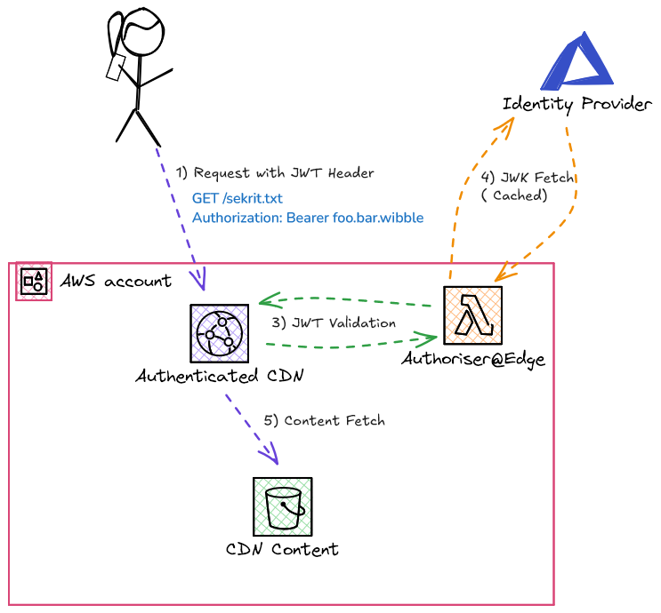

# Welcome to protected-cdn

Test Bed Project to demonstrate a CDN protected by Oauth JWT Tokens


## Architecture

The CDK stands up a sample Cloudfront CDN with a backing S3 bucket. The CDN is protected by a typescript [lambda@edge](https://aws.amazon.com/lambda/edge/).



## Configuration

Setting the following environment variable prior to deploying the stack will configure the lambda with the appropriate JWT validation settings.

* `JWKS_URI`
* `ISSUER`
* `AUDIENCE`

```
$JWKS_URI=https://login.microsoftonline.com/common/discovery/keys AUDIENCE=api://myapi ISSUER=https://sts.windows.net/${AZURE_TENANT}/ make deploy
npm install

up to date, audited 463 packages in 664ms

64 packages are looking for funding
  run `npm fund` for details

found 0 vulnerabilities
✓  init done
✓  build done
cdk deploy --all
Bundling asset edge-lambda-stack-c81b61c68a8f9621e0501a6a325be12145a4fbd238/Auth/Code/Stage...
COMMIT=e3ca695 BRANCH=router-add DATE=20240812 ./scripts/version.sh
npm ci
🛠️  bundle-lambda done

✨  Synthesis time: 12.59s
<...snip...>
 ✅  edge-lambda-stack-c81b61c68a8f9621e0501a6a325be12145a4fbd238

✨  Deployment time: 39.12s


Stack ARN:
arn:aws:cloudformation:us-east-1:0123456789:stack/edge-lambda-stack-c81b61c68a8f9621e0501a6a325be12145a4fbd238/9bea8a60-570f-11ef-a774-0affd709cf67

✨  Total time: 51.71s

AbcProtectedcdnProduction:  start: Publishing d20e060539cccf2be5ce26421ab79d5cb38272d45c77b56379435351b003539a:0123456789-eu-west-1
AbcProtectedcdnProduction:  success: Published d20e060539cccf2be5ce26421ab79d5cb38272d45c77b56379435351b003539a:0123456789-eu-west-1
AbcProtectedcdnProduction
AbcProtectedcdnProduction: deploying... [1/2]
AbcProtectedcdnProduction: creating CloudFormation changeset...

 ✅  AbcProtectedcdnProduction

✨  Deployment time: 161.01s

Outputs:
AbcProtectedcdnProduction.ProtectedCDNCdnUrlFC33EDD4 = dimbkitty5.cloudfront.net
Stack ARN:
arn:aws:cloudformation:eu-west-1:0123456789:stack/AbcProtectedcdnProduction/5a3f33d0-5701-11ef-9e9c-0aa4df143cf3

✨  Total time: 173.6s

🛠️  deploy/application done
✓  deploy done

```

## Operation

Ensure a JWT is passed into the CDN using a `Authorisation: Bearer $token` header e.g.

```curl -v -H "Authorization: Bearer foo.bar.wibble" https://dimbkitty5.cloudfront.net/```

Generating the bearer token can be done via any oauth2 flow using a helper for example:

* [oauth2c](https://github.com/cloudentity/oauth2c)


A unauthenticated version is available at `/version` for lambda validation:

```
$curl https://dimbkitty5.cloudfront.net/version
{"gitHash":"163bad7","buildBranch":"main","buildNumber":"1.0.0","buildDate":"2024-08-11T17:50"}
```


## Useful commands

-   `make clean` remove any intermediate state
-   `make diff` compare deployed stack with current state
-   `make deploy ` deploy this stack to your default AWS account/region
